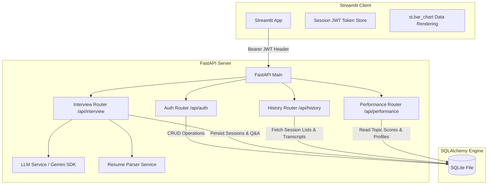

# AI Interview Assistant & ATS Resume Optimizer

A production-ready, full-stack AI Interview Coach built with **FastAPI** and **Streamlit** powered by **Google Gemini**. This project is designed for software developers looking to practice technical/behavioral mock interviews and optimize their resumes for Applicant Tracking Systems (ATS).

It features secure **JWT user authentication**, a local relational **SQLite database**, **ATS keyword profiling**, **adaptive question difficulty loops**, **anti-redundancy filters**, and **interactive performance tracking dashboards**.

---

## Key Features

1. **🔑 Secure JWT Authentication**: Robust registration, password hashing (bcrypt), and stateful route protection.
2. **📈 ATS Resume Optimizer**: Upload a resume alongside a target Job Description to receive compatibility scores (0-100%), skill gap audits (matched vs. missing skills), missing keyword alerts, and actionable structural advice.
3. **🎯 Adaptive Interview Simulation**:
   - Tailored technical/behavioral questions generated dynamically based on candidate resume skills and job specifications.
   - **Scalable Q&A Limits**: Custom interview lengths ranging from 3 up to **25 questions**.
   - **Adaptive Difficulty**: Question difficulty automatically scales (Easy ↔ Medium ↔ Hard) based on previous answer scores.
   - **Targeted Drilldown**: Prompts target weak categories (scores < 6/10) to test if candidates can clarify missing details.
   - **Strict Anti-Redundancy**: Feeds previously asked questions back to the generator to ensure zero duplication across long simulations.
4. **📊 Analytics Dashboard**: Renders overall score cards, executive suitability summaries, key strengths vs. focus areas, and interactive score progression charts.
5. **📈 Performance & Revision Profile**: Tracks candidate grades per subject area (OOP, SQL, DSA, OS, Networks, Python, Java) in the database, displays badges for strong and weak areas, plots topic-wise score averages, and delivers customized study/revision recommendations.
6. **📜 Session History Portal**: Browse past interview transcripts, review detailed feedback metrics, and track progress over time.

---

## Technical Architecture & Database Design



### Relational Database Schema
The database runs locally on SQLite using SQLAlchemy for migrations, making it compatible with cloud PostgreSQL databases:

* **`User`**: Account email and hashed password (bcrypt).
* **`InterviewSession`**: Target role metadata, resume text, ATS score, matched/missing skills, missing keywords, and recommendations.
* **`InterviewQuestion`**: Questions, target concepts, difficulty, candidate answers, score grades (1-10), strengths, weaknesses, and reference model answers.
* **`InterviewReport`**: Final overall score, executive summary, top strengths, top improvement areas, revision topics, concepts to strengthen, suggested focus, and coach suggestions.
* **`UserTopicScore`**: Dynamic running score tracking per topic (OOP, DSA, SQL, DBMS, networks, OS, Python, Java).
* **`PerformanceTracking`**: Dynamic user performance profile tracking weak topics, strong topics, and active difficulty level.

---

## Setup & Running Instructions

### Prerequisites
* Python 3.9 or higher
* Gemini API Key ([Get one at Google AI Studio](https://aistudio.google.com/))

### 1. Installation
Navigate to your project directory and set up a virtual environment:
```bash
cd ai_interview_assistant
python -m venv venv

# On Windows (PowerShell):
.\venv\Scripts\Activate.ps1
# On macOS/Linux:
source venv/bin/activate

pip install -r requirements.txt
```

### 2. Configure Environment Variables
Copy `.env.example` to `.env` and fill in your details:
```bash
copy .env.example .env
```
Inside `.env`:
```ini
GEMINI_API_KEY=your_gemini_api_key_here
SECRET_KEY=generate_a_secure_hex_key_here
ALGORITHM=HS256
ACCESS_TOKEN_EXPIRE_MINUTES=60
DATABASE_URL=sqlite:///./interview_coach.db
```

### 3. Start the Backend API (FastAPI)
Run from the root directory:
```bash
uvicorn backend.app.main:app --reload --port 8000
```
FastAPI will initialize and automatically create the SQLite tables. You can view the interactive documentation at `http://127.0.0.1:8000/docs`.

### 4. Start the Frontend Application (Streamlit)
In a **new terminal tab**, activate the virtual environment and run:
```bash
streamlit run frontend/app.py
```
Open `http://localhost:8501` to use the application.

---

## API Documentation Reference

All requests must include the header `Authorization: Bearer <JWT_TOKEN>`.

### Authentication
* **`POST /api/auth/register`**: Registers a new user account.
* **`POST /api/auth/token`**: Logs in a user using form-data (`username` and `password`) and returns a JWT token.

### Interviews & ATS
* **`POST /api/interview/session/start`**: Starts a mock interview session. Expects form-data: `job_title`, `job_description`, `max_questions`, and `file` (resume upload). Returns a `session_id`, parsed resume details, and the first question.
* **`POST /api/interview/session/{session_id}/answer`**: Submits a response. Evaluates the candidate's answer and returns the score card alongside the next question (or `null` if completed).
* **`POST /api/interview/session/{session_id}/finalize`**: Finalizes the session, aggregates question scores, updates performance profiles, and yields the final report.
* **`POST /api/interview/resume/ats-analyze`**: Performs a standalone ATS optimization scan.

### Performance Analytics
* **`GET /api/performance/profile`**: Returns the candidate's aggregated topic performance profile, including badges for strong/weak topics, average score breakdown data, active difficulty tier, and tailored study recommendations.

### History & Portal
* **`GET /api/history/sessions`**: Fetches all past sessions for the active user.
* **`GET /api/history/session/{session_id}`**: Fetches full transcripts, reports, and AI revision focus items for a past session.

---

## Application Previews & Screenshots

> [!NOTE]
> Below are structural placeholders for repository screenshots.

#### 1. Registration & Security Lock
*Simple login and account validation views secure the dashboard.*
`[Insert Login Screen Screenshot here]`

#### 2. Adaptive Technical Mock Interview
*Turn-based Q&A panels display active questions, recommended concepts, and difficulty tags.*
`[Insert Active Q&A Screen Screenshot here]`

#### 3. ATS Optimization Profiler
*Side-by-side grids highlight matching vs missing keywords and compatibility scores.*
`[Insert ATS Matcher Screenshot here]`

#### 4. Recruiter Portfolio Analytics Dashboard
*Score trend line charts, executive suitability reviews, and collapsible question logs.*
`[Insert Analytics Dashboard Screenshot here]`

---

## Cloud Deployment Instructions

### Deploying the Backend (Render / Railway / Heroku)
1. Link your GitHub repository.
2. Choose **Python** runtime environment.
3. Build Command: `pip install -r requirements.txt`
4. Start Command: `uvicorn backend.app.main:app --host 0.0.0.0 --port $PORT`
5. Configure Environment Variables in the cloud dashboard:
   - `GEMINI_API_KEY`
   - `SECRET_KEY` (Generate a secure value)
   - `DATABASE_URL` (SQLite works by default, or connect a Postgres instance URL).

### Deploying the Frontend (Streamlit Community Cloud)
1. Push the code to GitHub.
2. Sign up on [Streamlit Share](https://share.streamlit.io/).
3. Deploy new app: select your repository, branch, and set main file path to `frontend/app.py`.
4. Add Advanced Setting Environment Variables:
   - `BACKEND_URL`: The deployed FastAPI service URL (e.g. `https://your-backend.onrender.com`).
   - `GEMINI_API_KEY`: *(Optional fallback key)*.

---

## Future Roadmap

- [ ] **Speech-to-Text (STT) Integration**: Allow candidates to record their answers directly using their microphone.
- [ ] **Real-Time Video Mocking**: Add face track feedback and emotion analysis.
- [ ] **Multi-Role Comparison**: Compare resume matching against multiple job descriptions simultaneously.
- [ ] **Automatic GitHub Action CI**: Format check and test coverage pipelines.
