# AI Interview Assistant and ATS Resume Optimizer

[](https://www.python.org/)
[](https://fastapi.tiangolo.com/)
[](https://streamlit.io/)
[](https://www.sqlite.org/)
[](https://jwt.io/)
[](https://deepmind.google/technologies/gemini/)

An enterprise-grade, full-stack AI-powered technical assessment platform designed to simulate end-to-end recruiter screenings, generate adaptive technical evaluations, and perform Applicant Tracking System (ATS) optimization scans. 

Built with a decoupled FastAPI backend architecture and a responsive Streamlit frontend client, this platform utilizes Google Gemini models for deep text extraction, semantic analysis, and turn-based adaptive coaching evaluation. It serves as a showcase of scalable backend design, secure stateful session handling, database tracking schemas, and prompt engineering principles.

---

## Live Demo

Frontend: <TO_BE_FILLED_AFTER_DEPLOYMENT>

Backend API Docs: <TO_BE_FILLED_AFTER_DEPLOYMENT>

---

## Table of Contents

- [Project Highlights](#project-highlights)
- [Impact Highlights](#impact-highlights)
- [Key Features](#key-features)
- [Core API Endpoints](#core-api-endpoints)
- [Project Structure](#project-structure)
- [Screenshots and Features Walkthrough](#screenshots-and-features-walkthrough)
- [System Architecture](#system-architecture)
- [Database Design](#database-design)
- [Detailed System Workflows](#detailed-system-workflows)
- [Tech Stack Details](#tech-stack-details)
- [Installation and Setup Instructions](#installation-and-setup-instructions)
- [Cloud Deployment Guide](#cloud-deployment-guide)
- [Author](#author)
- [Resume Project Summary](#resume-project-summary)
- [Future Enhancements](#future-enhancements)

---

## Project Highlights

- **AI-Powered Evaluation Pipeline**: Real-time turn-based response grading and adaptive question dispatching using Google Gemini 2.5 Flash.
- **Adaptive Interview Difficulty**: Dynamic difficulty leveling (Easy, Medium, Hard) and weak-area priority routing based on rolling user performance scores.
- **ATS Resume Matching and Skill-Gap Analysis**: Performs deep semantic comparison between resume experiences and target job qualifications.
- **Secure Authentication and Session Management**: Pre-hashed SHA-256 password storage before bcrypt processing to bypass standard length limits while ensuring maximum entropy.
- **Full-Stack Decoupled Architecture**: Optimized REST API communication between a FastAPI gateway and a responsive Streamlit client.
- **Performance Analytics Dashboard**: SQLite schema aggregates user performance across core technical domains to render rolling averages and improvement suggestions.

---

## Impact Highlights

- Built a full-stack AI Interview Assistant and ATS Optimizer using FastAPI, Streamlit, SQLite, SQLAlchemy, JWT Authentication, and the Google Gemini API.
- Developed 15+ REST API endpoints for authentication, ATS analysis, interview management, performance analytics, and report generation.
- Implemented adaptive interview generation using topic-wise performance tracking and dynamic difficulty adjustment.
- Designed relational database architecture with multiple interconnected models and session persistence.
- Integrated AI-powered ATS resume analysis, answer evaluation, and personalized recommendation workflows.
- Added fault-tolerant report generation and robust fallback mechanisms for API/network failures.
- Implemented secure authentication with password hashing, JWT token validation, and protected endpoints.

---

## Key Features

- **JWT Authentication**: Secure stateful user credentials with bcrypt encryption and token-based endpoint access control.
- **ATS Resume Analyzer**: Upload resumes and perform scans to generate compatibility scores, detect missing skills, and provide keyword recommendations.
- **Job Description Matching**: Deep semantic comparison between resume experiences and target job qualifications.
- **Adaptive Interview Engine**: Adapts subsequent questions (Easy, Medium, Hard) and prioritizes weak areas based on candidate performance.
- **AI Answer Evaluation**: Real-time turn-based grading (1-10) with detailed feedback, strengths, weaknesses, and exemplar model answers.
- **Topic-wise Performance Tracking**: Tracks cumulative user performance across core technical domains (OOP, DSA, SQL, DBMS, Networks, OS).
- **Improvement Analytics**: Interactive dashboard showing score trends over time and weak/strong skill badges.
- **Personalized Recommendations**: Automatically compiles concrete topic revision guides and practice advice when finalizing sessions.
- **Interview History Management**: Persistent repository of all past mock interview transcripts and performance scorecard results.
- **Fault-Tolerant Report Generation**: Advanced backend error handling that compiles standard fallbacks if connection timeouts or API issues occur.

---

## Core API Endpoints

| Endpoint | HTTP Method | Auth Required | Description |
| :--- | :--- | :--- | :--- |
| `/api/auth/register` | `POST` | No | Creates a new candidate user account with Bcrypt password hashing. |
| `/api/auth/token` | `POST` | No | Authenticates credentials and returns a secure JWT access token. |
| `/api/interview/resume/ats-analyze` | `POST` | Yes | Uploads resume and job description to return score, skill matching, and keywords. |
| `/api/interview/session/start` | `POST` | Yes | Initiates a new stateful mock interview session and returns the first question. |
| `/api/interview/session/{session_id}/answer` | `POST` | Yes | Submits candidate answer, returns real-time grading, and yields next adaptive question. |
| `/api/interview/session/{session_id}/finalize` | `POST` | Yes | Finalizes the session, updates proficiency scores, and saves final report scorecard. |
| `/api/history/sessions` | `GET` | Yes | Retrieves list of all past interview sessions for the authenticated user. |
| `/api/history/session/{session_id}` | `GET` | Yes | Returns full transcript details, grading metrics, and final scorecard for a session. |
| `/api/performance/profile` | `GET` | Yes | Compiles user-level cumulative topic averages, strength/weakness badges, and practice recommendations. |

---

## Project Structure

```
.
├── backend/
│   └── app/
│       ├── routes/
│       │   ├── auth.py
│       │   ├── history.py
│       │   ├── interview.py
│       │   └── performance.py
│       ├── services/
│       │   ├── llm_service.py
│       │   └── resume_service.py
│       ├── utils/
│       │   ├── auth.py
│       │   ├── helpers.py
│       │   └── logger.py
│       ├── config.py
│       ├── database.py
│       ├── main.py
│       ├── models.py
│       └── schemas.py
├── docs/
│   └── screenshots/
├── frontend/
│   └── app.py
├── .env.example
├── README.md
└── requirements.txt
```

---

## Screenshots and Features Walkthrough

### User Authentication
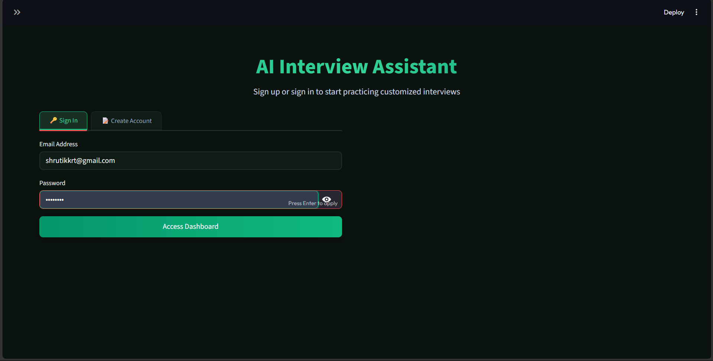

Secure JWT-based user authentication and account management.

---

### Interview Dashboard
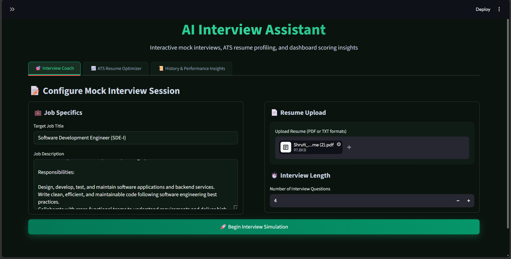

Centralized dashboard for interview practice, ATS analysis, and performance tracking.

---

### ATS Resume Analysis
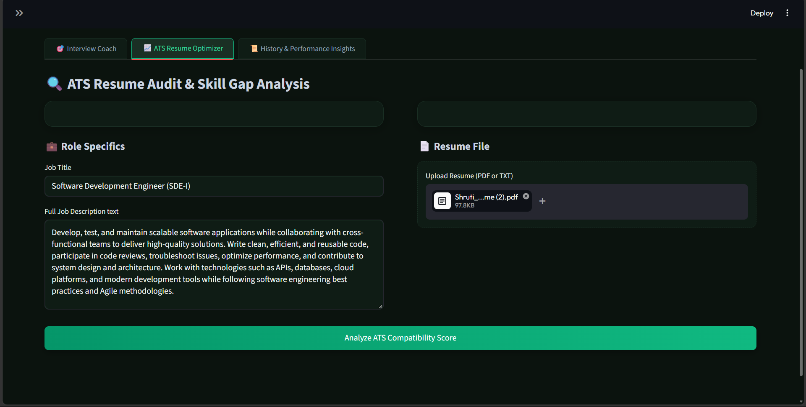
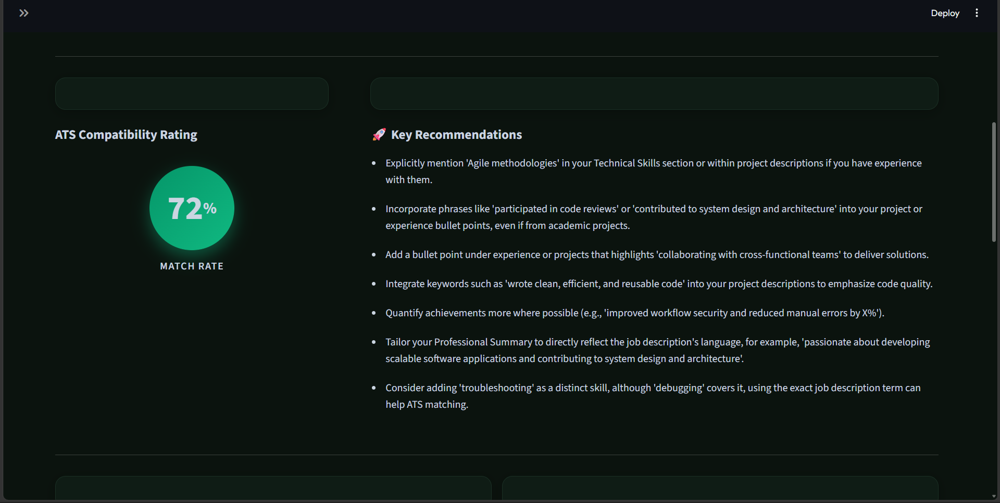

Upload resume and compare against a target job description.
Generate ATS score, skill match analysis, missing skills, and improvement suggestions.

---

### AI Interview Generation
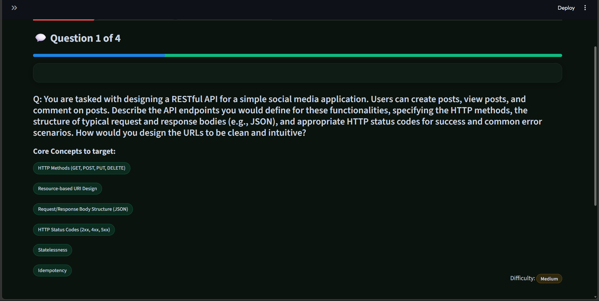

Generate personalized interview questions based on resume, job role, and adaptive difficulty.

---

### Answer Evaluation
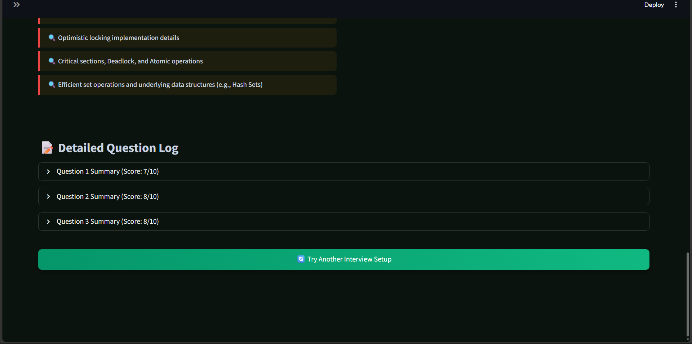

AI-powered answer scoring with detailed performance feedback.

---

### Performance Analytics
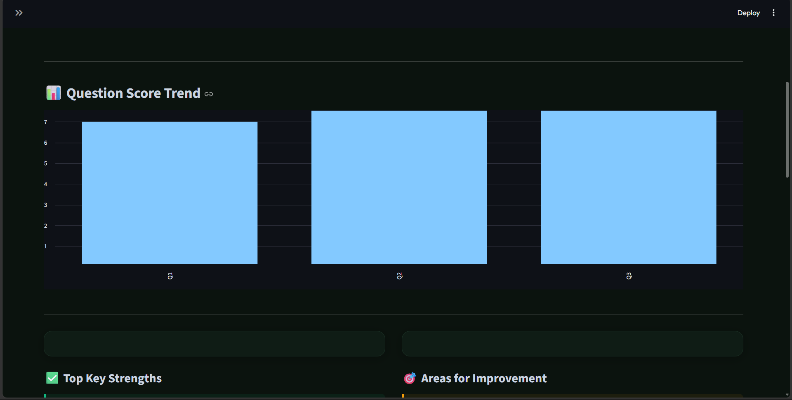
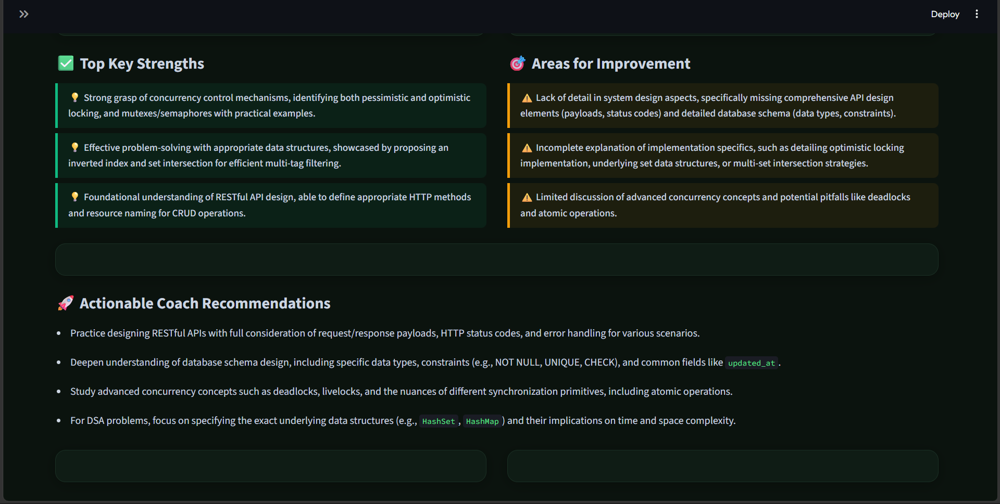

Track progress across interviews, identify weak areas, and visualize improvement trends.

---

### Personalized Recommendations
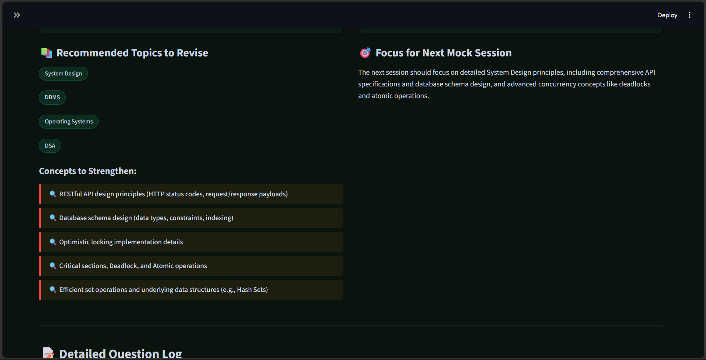
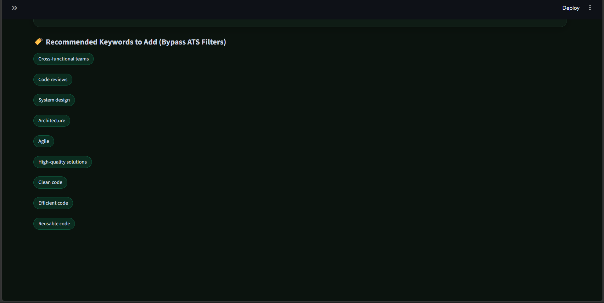

Generate tailored learning recommendations, topic revision plans, and resume enhancement suggestions.

---

## System Architecture

The following diagram details the flow of communication between the frontend client, the API routers, the LLM service layer, and the relational database:

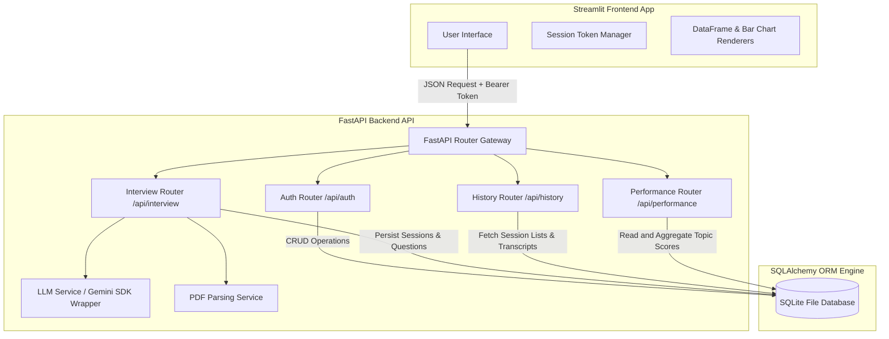

---

## Database Design

The database layer is managed using SQLAlchemy ORM to enforce relationship constraints, structural integrity, and smooth migration paths to PostgreSQL or MySQL:

### Schemas and Models

- **User**: Represents candidate credentials.
  - `id` (Integer, Primary Key)
  - `email` (String, Unique, Index)
  - `hashed_password` (String)
  - `created_at` (DateTime)
- **InterviewSession**: Tracks individual interview sessions or ATS checks.
  - `id` (Integer, Primary Key)
  - `user_id` (Integer, Foreign Key to User)
  - `job_title` (String)
  - `job_description` (Text)
  - `resume_text` (Text)
  - `ats_score` (Integer, Optional)
  - `ats_skills_matched` (JSON, List of strings)
  - `ats_skills_missing` (JSON, List of strings)
  - `ats_keywords_missing` (JSON, List of strings)
  - `ats_recommendations` (JSON, List of strings)
  - `max_questions` (Integer)
  - `created_at` (DateTime)
- **InterviewQuestion**: Holds details of each question and turn evaluation.
  - `id` (Integer, Primary Key)
  - `session_id` (Integer, Foreign Key to InterviewSession)
  - `question_text` (Text)
  - `focus_area` (String)
  - `expected_concepts` (JSON, List of strings)
  - `difficulty` (String)
  - `candidate_answer` (Text, Optional)
  - `score` (Integer, Optional)
  - `feedback` (Text, Optional)
  - `strengths` (JSON, Optional)
  - `weaknesses` (JSON, Optional)
  - `model_answer` (Text, Optional)
  - `created_at` (DateTime)
- **InterviewReport**: Represents final summary scorecards.
  - `id` (Integer, Primary Key)
  - `session_id` (Integer, Foreign Key to InterviewSession, Unique)
  - `overall_score` (Integer)
  - `summary` (Text)
  - `key_strengths` (JSON)
  - `improvement_areas` (JSON)
  - `recommendations` (JSON)
  - `topics_to_revise` (JSON, List of strings)
  - `concepts_to_strengthen` (JSON, List of strings)
  - `suggested_focus` (String)
  - `created_at` (DateTime)
- **UserTopicScore**: Tracks cumulative topic-wise running scores.
  - `id` (Integer, Primary Key)
  - `user_id` (Integer, Foreign Key to User)
  - `topic` (String)
  - `total_score` (Integer)
  - `question_count` (Integer)
  - `avg_score` (Float)
  - `last_updated` (DateTime)
- **PerformanceTracking**: Maintains the overall user performance profile.
  - `id` (Integer, Primary Key)
  - `user_id` (Integer, Foreign Key to User, Unique)
  - `weak_topics` (JSON, List of strings)
  - `strong_topics` (JSON, List of strings)
  - `difficulty_level` (String)
  - `last_updated` (DateTime)

---

## Detailed System Workflows

### 1. Authentication Flow

To prevent database truncation errors when using bcrypt (which has a native limit of 72 bytes), the backend applies SHA-256 pre-hashing to the password string before passing it to the bcrypt hashing algorithm. This allows users to register secure passwords up to 128 characters long.

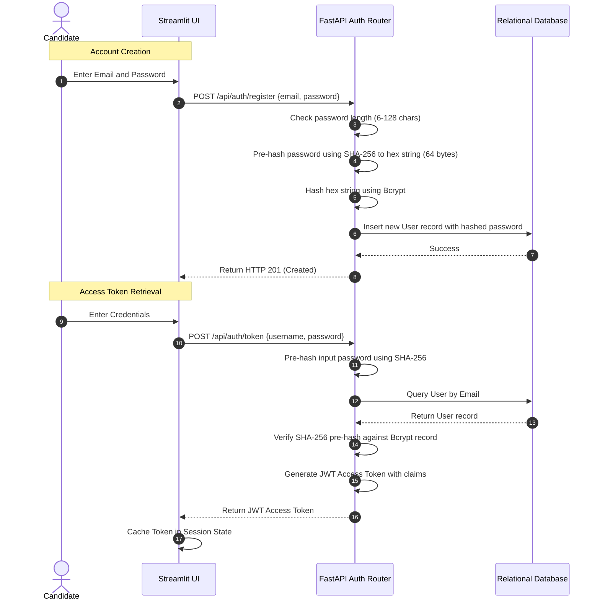

---

### 2. ATS Analysis Workflow

This workflow allows candidates to verify resume compatibility against a target job description:

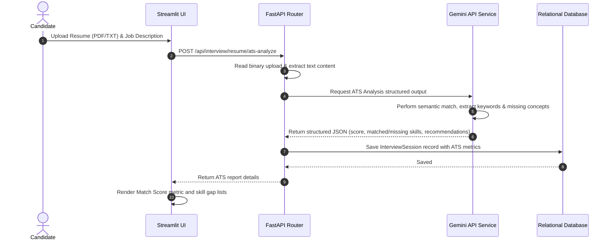

---

### 3. Adaptive Interview Engine Workflow

The mock interviewer utilizes stateful DB registers to generate subsequent questions adapted to the candidate's performance profile:

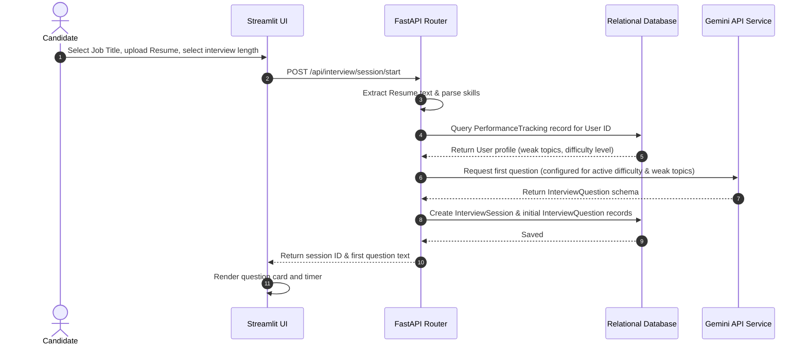

---

### 4. AI Evaluation and Topic Recalculation Workflow

Each turn triggers a loop that evaluates the candidate's answer and recalculates their overall performance profile:

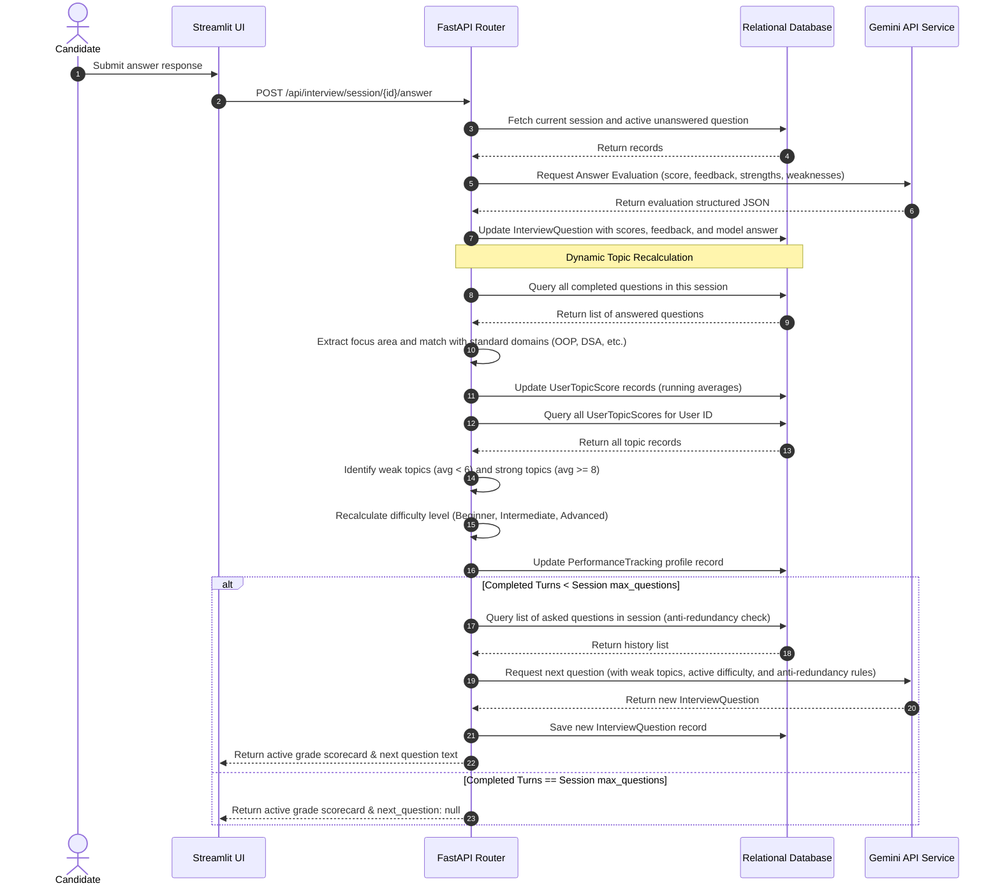

---

## Tech Stack Details

- **Backend Framework**: FastAPI (Asynchronous gateways, type validation using Pydantic, dependency injection patterns).
- **Frontend Client**: Streamlit (Reactive layout state, customized CSS theme injection, pandas data visualizers).
- **AI Orchestration**: Google GenAI SDK (Interfacing with `gemini-2.5-flash` model, schema-enforced JSON generation).
- **Database Engine**: SQLAlchemy ORM with SQLite (Local file-based system, relationships, cascade deletes, JSON columns).
- **Security Utilities**: PyJWT (JSON Web Tokens) and native bcrypt hashing.
- **Resume Extractor**: PyPDF2 (Binary text stream processing).

---

## Installation & Setup Instructions

### Prerequisites
- Python 3.9 or higher installed.
- A Google Gemini API Key. You can get one from the [Google AI Studio](https://aistudio.google.com/).

### 1. Repository Setup
Clone the repository and navigate into the project directory:
```bash
git clone https://github.com/Shruttik/ai-interview-assistant.git
cd ai-interview-assistant
```

### 2. Environment Configuration
Create a virtual environment and install the required dependencies:
```bash
python -m venv venv

# Activate the virtual environment
# On Windows (PowerShell):
.\venv\Scripts\Activate.ps1
# On macOS/Linux:
source venv/bin/activate

pip install -r requirements.txt
```

Create a `.env` file in the root directory of the project:
```bash
copy .env.example .env
```

Open the `.env` file and configure the variables:
```ini
GEMINI_API_KEY=your_gemini_api_key_here
SECRET_KEY=generate_a_secure_hex_key_here
ALGORITHM=HS256
ACCESS_TOKEN_EXPIRE_MINUTES=60
DATABASE_URL=sqlite:///./interview_coach.db
```

### 3. Database Initialization
Run the initialization script to generate the database schema and tables inside SQLite:
```bash
python -c "from backend.app.database import engine, Base; from backend.app import models; Base.metadata.create_all(bind=engine)"
```

### 4. Running the Backend Server
Start the FastAPI server using Uvicorn:
```bash
uvicorn backend.app.main:app --reload --port 8000
```
The API documentation will be available at `http://127.0.0.1:8000/docs`.

### 5. Running the Frontend Application
In a separate terminal, activate the virtual environment and start the Streamlit client:
```bash
streamlit run frontend/app.py
```
Open `http://localhost:8501` in your browser to view the application.

---

## Cloud Deployment Guide

### Deploying the Backend API (Render / Railway / Heroku)
1. Push your code to your GitHub repository.
2. Link the repository to your hosting service (e.g. Render Web Service).
3. Set the runtime environment to **Python**.
4. Set the **Build Command**: `pip install -r requirements.txt`
5. Set the **Start Command**: `uvicorn backend.app.main:app --host 0.0.0.0 --port $PORT`
6. Add the following environment variables to the web service console:
   - `GEMINI_API_KEY`
   - `SECRET_KEY`
   - `ALGORITHM`
   - `DATABASE_URL` (You can keep the SQLite URL or link a PostgreSQL database address).

### Deploying the Frontend Client (Streamlit Community Cloud)
1. Sign up or log in at [Streamlit Share](https://share.streamlit.io/).
2. Click **Deploy an App**, and select your repository and branch.
3. Set the Main File Path to `frontend/app.py`.
4. In the **Advanced Settings** dialog, configure your environment variables:
   - `BACKEND_URL`: The URL of your deployed FastAPI backend service.
   - `GEMINI_API_KEY`: (Optional fallback key).

---

## Author

**Shruti Kukreti**
- **Education**: B.Tech in Computer Science & Engineering, Graphic Era Hill University
- **GitHub**: [github.com/Shruttik](https://github.com/Shruttik)
- **LinkedIn**: [linkedin.com/in/shruti-kukreti-5603a428b](https://www.linkedin.com/in/shruti-kukreti-5603a428b)

---

## Resume Project Summary

**AI Interview Assistant & ATS Resume Optimizer** (Full-Stack AI Application)
- Engineered a decoupled web application leveraging a modular **FastAPI** REST API backend and a responsive **Streamlit** frontend client to automate candidate evaluations.
- Developed an adaptive mock interview engine using **Google Gemini 2.5 Flash** that dynamically tunes question difficulty (Easy, Medium, Hard) and prioritizes weak skill areas based on rolling session scores.
- Implemented stateful user sessions, password hashing with raw **Bcrypt**, and token-based protected endpoints using **PyJWT** and **SQLAlchemy** SQLite integration.
- Designed an automated ATS scanner performing semantic matching and keyword extraction, generating skill gap card reports and formatting suggestions.
- Integrated structured logger tracing and fault-tolerant fallback scoring logic to guarantee 100% session persistence under API network connectivity failures.

---

## Future Enhancements

- **Voice Response Integration**: Integrate Speech-to-Text (STT) services to allow candidates to speak their answers.
- **Video Handshake Analysis**: Integrate camera inputs to evaluate non-verbal communication, posture, and facial indicators.
- **Role Benchmarking**: Benchmark candidate performance against profiles of successful employees in specific target roles.
- **CI/CD Integration**: Automatic linting, format checking, and testing pipelines.
