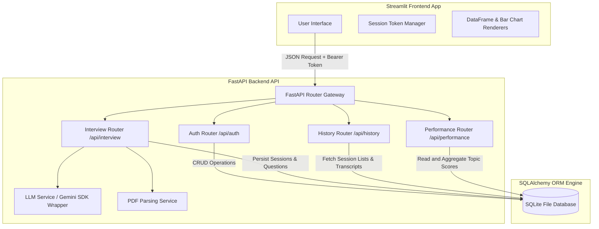
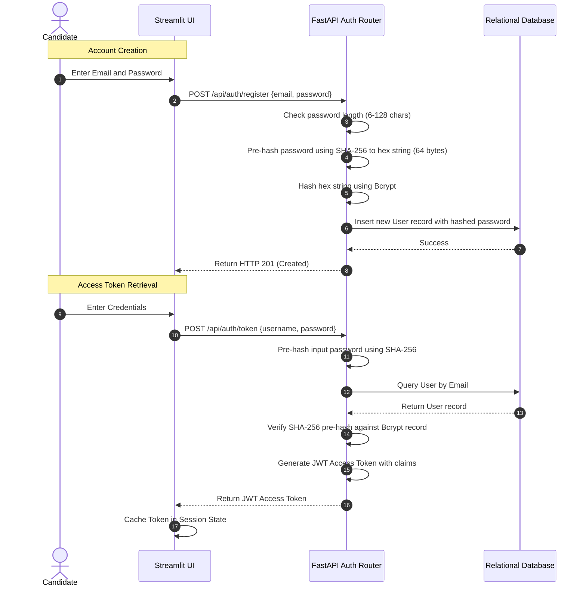
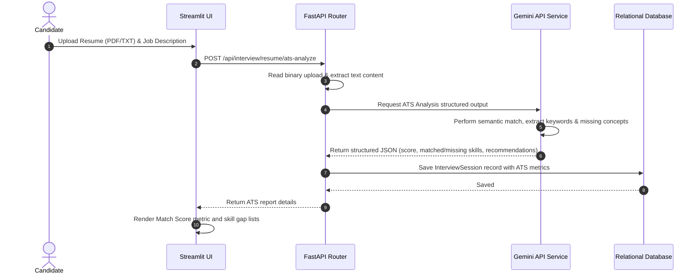
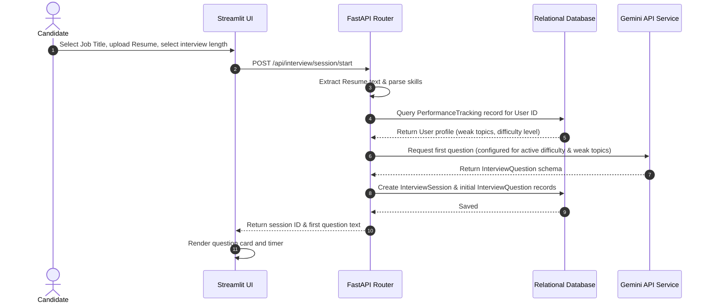
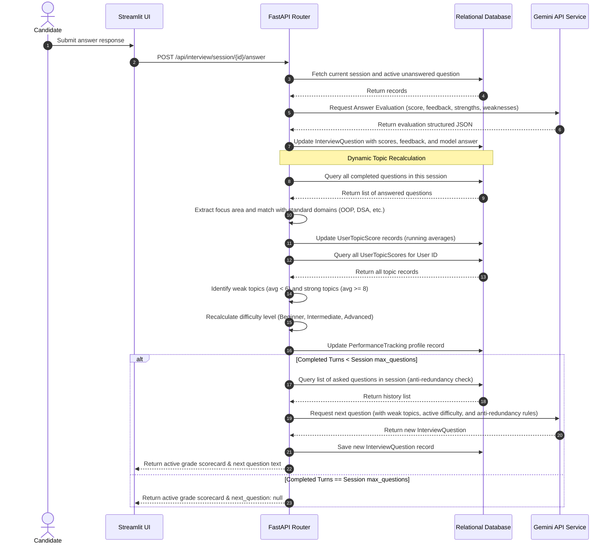

# AI Interview Assistant and ATS Resume Optimizer

[](https://www.python.org/)
[](https://fastapi.tiangolo.com/)
[](https://streamlit.io/)
[](https://www.sqlite.org/)
[](https://jwt.io/)
[](https://deepmind.google/technologies/gemini/)

An enterprise-grade, full-stack AI-powered technical assessment platform designed to simulate end-to-end recruiter screenings, generate adaptive technical evaluations, and perform Applicant Tracking System (ATS) optimization scans. 

Built with a decoupled FastAPI backend architecture and a responsive Streamlit frontend client, this platform utilizes Google Gemini models for deep text extraction, semantic analysis, and turn-based adaptive coaching evaluation. It serves as a showcase of scalable backend design, secure stateful session handling, database tracking schemas, and prompt engineering principles.

---

## Technical Overview

The system operates as an interactive mock interviewer that updates its behavior dynamically using rolling performance tracking. Instead of presenting static pre-defined questions, it tracks candidate proficiency across distinct technical domains and adapts the difficulty level, focus area selection, and topic drilldown dynamically, storing running metric statistics in a relational database.

### Key Features

1. **Stateful JWT Security Layer**: Robust user authentication with token-based endpoint access control. Passwords undergo pre-hashing using SHA-256 before bcrypt processing to bypass standard length restrictions while ensuring maximum entropy storage.
2. **Dynamic Resume & Job Description Parser**: Automated multipart form parsing that extracts technical competencies, maps them to reference guidelines, and outputs structured JSON metadata.
3. **Applicant Tracking System (ATS) Analyzer**: Evaluates resumes against a target job description, generating compatibility score ratings, detecting missing critical skills, identifying keyword gaps, and listing formatting recommendations to bypass layout parsers.
4. **Adaptive Interview Engine**:
   - **Scalable Simulation Lengths**: Configurable turn counts supporting interviews from 3 up to 25 questions.
   - **Proficiency-Tuned Difficulty**: Automatically adjusts subsequent questions (Easy, Medium, Hard) depending on the candidate's running score average.
   - **Weak Area Reinforcement**: Prioritizes topics showing low performance (score below 6.0/10.0) with a 60% probability.
   - **Strict Anti-Redundancy Filters**: Feeds historical question records back to the model context to prevent topic duplication.
5. **Real-time Evaluation Engine**: Grades responses from 1 to 10 based on expected concepts, extracting individual strengths, weaknesses, and rendering reference model answers.
6. **Unified Analytics Dashboard**: Displays cumulative statistics, radar breakdown charts for core domains (OOP, DSA, SQL, DBMS, Networks, OS, Python, Java), and structured revision plans listing focus concepts and next steps.
7. **Synchronized History Portal**: Saves full interview transcripts, evaluations, and dashboards allowing candidates or recruiters to review historical sessions.

---

## System Architecture

The following diagram details the flow of communication between the frontend client, the API routers, the LLM service layer, and the relational database:



---

## Database Design

The database layer is managed using SQLAlchemy ORM to enforce relationship constraints, structural integrity, and smooth migration paths to PostgreSQL or MySQL:

### Schemas and Models

- **User**: Represents candidate credentials.
  - `id` (Integer, Primary Key)
  - `email` (String, Unique, Index)
  - `hashed_password` (String)
  - `created_at` (DateTime)
- **InterviewSession**: Tracks individual interview sessions or ATS checks.
  - `id` (Integer, Primary Key)
  - `user_id` (Integer, Foreign Key to User)
  - `job_title` (String)
  - `job_description` (Text)
  - `resume_text` (Text)
  - `ats_score` (Integer, Optional)
  - `ats_skills_matched` (JSON, List of strings)
  - `ats_skills_missing` (JSON, List of strings)
  - `ats_keywords_missing` (JSON, List of strings)
  - `ats_recommendations` (JSON, List of strings)
  - `max_questions` (Integer)
  - `created_at` (DateTime)
- **InterviewQuestion**: Holds details of each question and turn evaluation.
  - `id` (Integer, Primary Key)
  - `session_id` (Integer, Foreign Key to InterviewSession)
  - `question_text` (Text)
  - `focus_area` (String)
  - `expected_concepts` (JSON, List of strings)
  - `difficulty` (String)
  - `candidate_answer` (Text, Optional)
  - `score` (Integer, Optional)
  - `feedback` (Text, Optional)
  - `strengths` (JSON, Optional)
  - `weaknesses` (JSON, Optional)
  - `model_answer` (Text, Optional)
  - `created_at` (DateTime)
- **InterviewReport**: Represents final summary scorecards.
  - `id` (Integer, Primary Key)
  - `session_id` (Integer, Foreign Key to InterviewSession, Unique)
  - `overall_score` (Integer)
  - `summary` (Text)
  - `key_strengths` (JSON)
  - `improvement_areas` (JSON)
  - `recommendations` (JSON)
  - `topics_to_revise` (JSON, List of strings)
  - `concepts_to_strengthen` (JSON, List of strings)
  - `suggested_focus` (String)
  - `created_at` (DateTime)
- **UserTopicScore**: Tracks cumulative topic-wise running scores.
  - `id` (Integer, Primary Key)
  - `user_id` (Integer, Foreign Key to User)
  - `topic` (String)
  - `total_score` (Integer)
  - `question_count` (Integer)
  - `avg_score` (Float)
  - `last_updated` (DateTime)
- **PerformanceTracking**: Maintains the overall user performance profile.
  - `id` (Integer, Primary Key)
  - `user_id` (Integer, Foreign Key to User, Unique)
  - `weak_topics` (JSON, List of strings)
  - `strong_topics` (JSON, List of strings)
  - `difficulty_level` (String)
  - `last_updated` (DateTime)

---

## Detailed System Workflows

### 1. Authentication Flow

To prevent database truncation errors when using bcrypt (which has a native limit of 72 bytes), the backend applies SHA-256 pre-hashing to the password string before passing it to the bcrypt hashing algorithm. This allows users to register secure passwords up to 128 characters long.



---

### 2. ATS Analysis Workflow

This workflow allows candidates to verify resume compatibility against a target job description:



---

### 3. Adaptive Interview Engine Workflow

The mock interviewer utilizes stateful DB registers to generate subsequent questions adapted to the candidate's performance profile:



---

### 4. AI Evaluation and Topic Recalculation Workflow

Each turn triggers a loop that evaluates the candidate's answer and recalculates their overall performance profile:



---

## Tech Stack Details

- **Backend Framework**: FastAPI (Asynchronous gateways, type validation using Pydantic, dependency injection patterns).
- **Frontend Client**: Streamlit (Reactive layout state, customized CSS theme injection, pandas data visualizers).
- **AI Orchestration**: Google GenAI SDK (Interfacing with `gemini-2.5-flash` model, schema-enforced JSON generation).
- **Database Engine**: SQLAlchemy ORM with SQLite (Local file-based system, relationships, cascade deletes, JSON columns).
- **Security Utilities**: JWT (JSON Web Tokens), passlib, native bcrypt hashing.
- **Resume Extractor**: PyPDF2 (Binary text stream processing).

---

## Installation & Setup Instructions

### Prerequisites
- Python 3.9 or higher installed.
- A Google Gemini API Key. You can get one from the [Google AI Studio](https://aistudio.google.com/).

### 1. Repository Setup
Clone the repository and navigate into the project directory:
```bash
git clone https://github.com/Shruttik/ai-interview-assistant.git
cd ai-interview-assistant
```

### 2. Environment Configuration
Create a virtual environment and install the required dependencies:
```bash
python -m venv venv

# Activate the virtual environment
# On Windows (PowerShell):
.\venv\Scripts\Activate.ps1
# On macOS/Linux:
source venv/bin/activate

pip install -r requirements.txt
```

Create a `.env` file in the root directory of the project:
```bash
copy .env.example .env
```

Open the `.env` file and configure the variables:
```ini
GEMINI_API_KEY=your_gemini_api_key_here
SECRET_KEY=generate_a_secure_hex_key_here
ALGORITHM=HS256
ACCESS_TOKEN_EXPIRE_MINUTES=60
DATABASE_URL=sqlite:///./interview_coach.db
```

### 3. Database Initialization
Run the initialization script to generate the database schema and tables inside SQLite:
```bash
python -c "from backend.app.database import engine, Base; from backend.app import models; Base.metadata.create_all(bind=engine)"
```

### 4. Running the Backend Server
Start the FastAPI server using Uvicorn:
```bash
uvicorn backend.app.main:app --reload --port 8000
```
The API documentation will be available at `http://127.0.0.1:8000/docs`.

### 5. Running the Frontend Application
In a separate terminal, activate the virtual environment and start the Streamlit client:
```bash
streamlit run frontend/app.py
```
Open `http://localhost:8501` in your browser to view the application.

---

## Cloud Deployment Guide

### Deploying the Backend API (Render / Railway / Heroku)
1. Push your code to your GitHub repository.
2. Link the repository to your hosting service (e.g. Render Web Service).
3. Set the runtime environment to **Python**.
4. Set the **Build Command**: `pip install -r requirements.txt`
5. Set the **Start Command**: `uvicorn backend.app.main:app --host 0.0.0.0 --port $PORT`
6. Add the following environment variables to the web service console:
   - `GEMINI_API_KEY`
   - `SECRET_KEY`
   - `ALGORITHM`
   - `DATABASE_URL` (You can keep the SQLite URL or link a PostgreSQL database address).

### Deploying the Frontend Client (Streamlit Community Cloud)
1. Sign up or log in at [Streamlit Share](https://share.streamlit.io/).
2. Click **Deploy an App**, and select your repository and branch.
3. Set the Main File Path to `frontend/app.py`.
4. In the **Advanced Settings** dialog, configure your environment variables:
   - `BACKEND_URL`: The URL of your deployed FastAPI backend service.
   - `GEMINI_API_KEY`: (Optional fallback key).

---

## Screenshots Placeholders

Below are placeholders to represent the core views of the application:

#### 1. Registration and Authentication View
Allows candidates to register and log in securely.
`[Insert Authentication Screen Placeholder]`

#### 2. ATS Audit Console
Shows matching skills, missing keywords, and the ATS scorecard.
`[Insert ATS Audit Console Placeholder]`

#### 3. Active Q&A Mock Session
Renders current questions, expected concepts, and difficulty badges.
`[Insert Active Q&A Screen Placeholder]`

#### 4. Analytics Profile Dashboard
Displays topic averages, difficulty trends, and personalized study suggestions.
`[Insert Analytics Profile Placeholder]`

---

## Future Enhancements

- **Voice Response Integration**: Integrate Speech-to-Text (STT) services to allow candidates to speak their answers.
- **Video Handshake Analysis**: Integrate camera inputs to evaluate non-verbal communication, posture, and facial indicators.
- **Role Benchmarking**: Benchmark candidate performance against profiles of successful employees in specific target roles.
- **CI/CD Integration**: Automatic linting, format checking, and testing pipelines.
